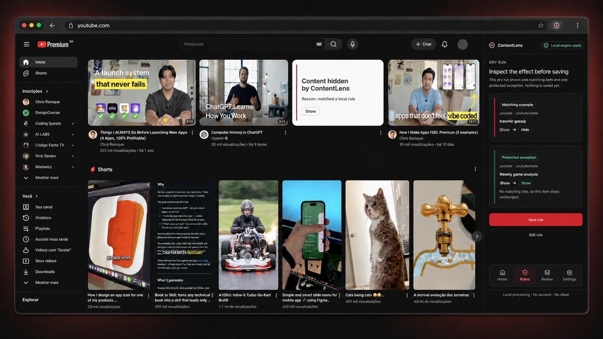
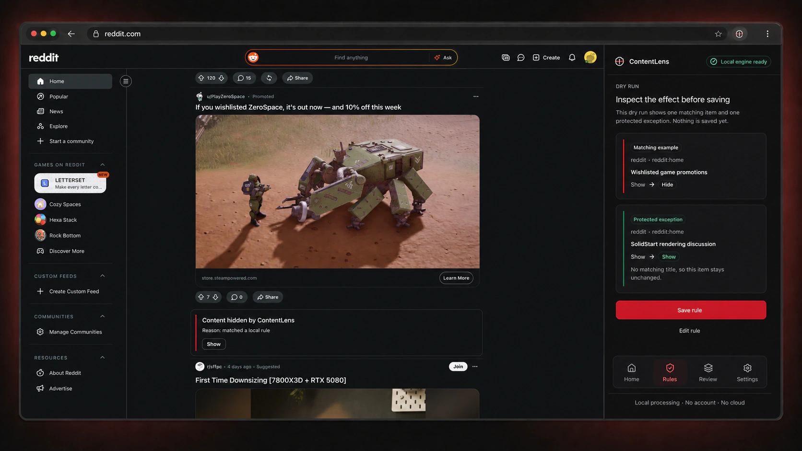
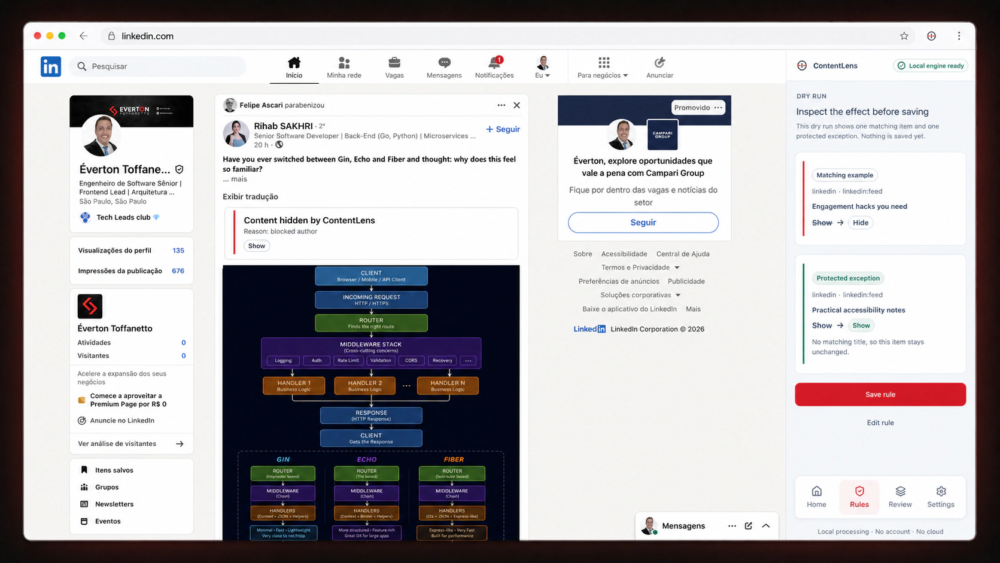
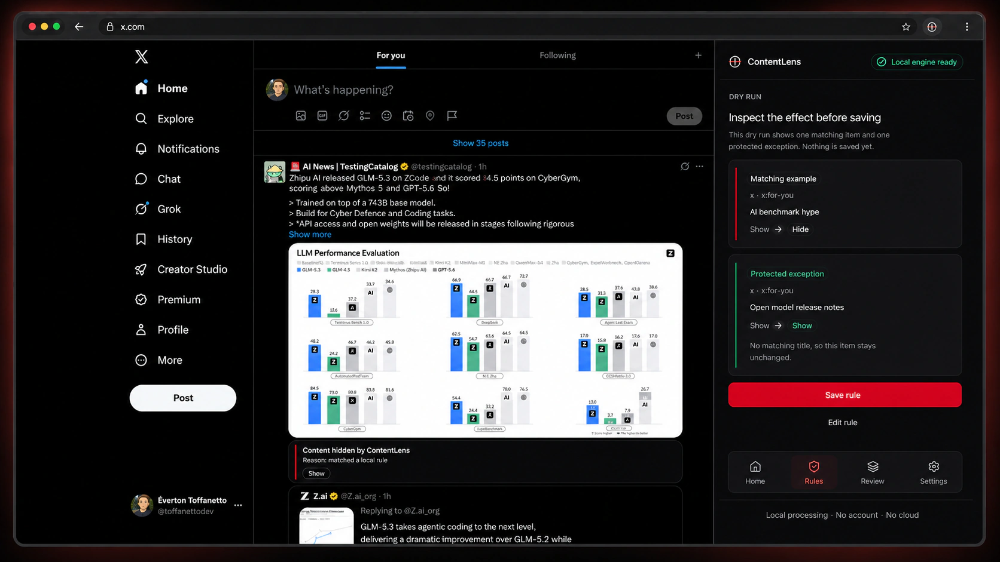
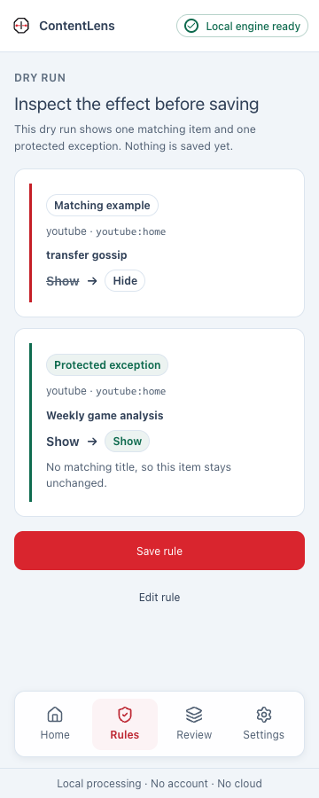
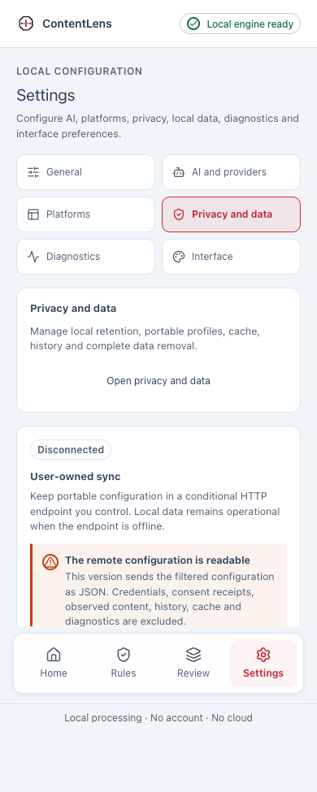
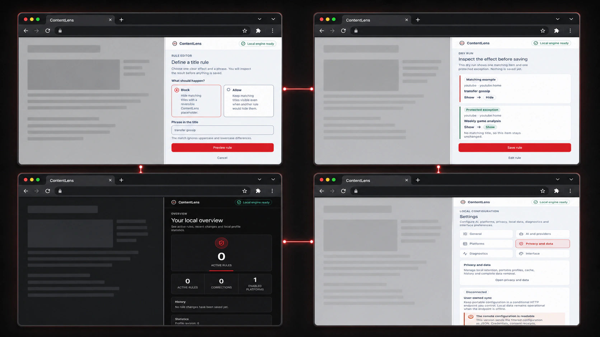
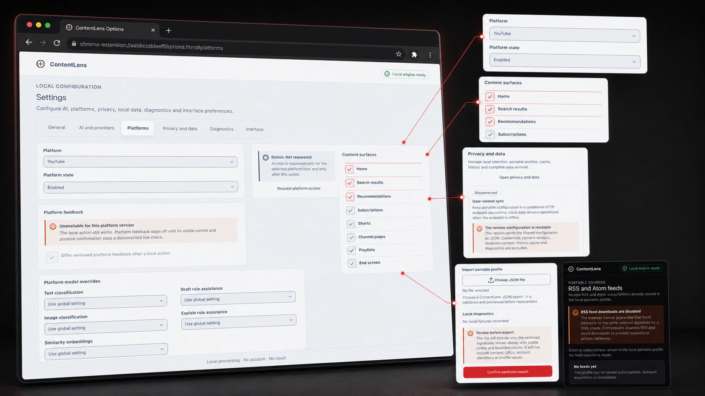

# ContentLens

[](https://github.com/everton-dgn/content-lens/actions/workflows/ci.yml)
[](https://github.com/everton-dgn/content-lens/actions/workflows/docs.yml)
[](https://github.com/everton-dgn/content-lens/releases/latest)
[](LICENSE)

> **Your feeds. Your rules.**

ContentLens is a local-first browser extension that filters YouTube, LinkedIn,
X, Reddit and Hacker News with rules you write. Block a channel, an author or a
phrase. Every hidden item leaves a placeholder that explains the decision and
brings the content back in one action.

The deterministic baseline runs in your browser profile. No account. No
required backend. No telemetry.



**[Install for Chrome](https://chromewebstore.google.com/detail/njpapeialgojodjmpjmnoplebgiogkcp)**
· **[Install for Firefox](https://addons.mozilla.org/firefox/addon/contentlens/)**
· [Install in 2 minutes](#install)
· [Build from source](#from-source)
· [Read the manifesto](MANIFESTO.md)

Both stores carry the signed package for the current stable version. Every
release also publishes `content-lens-<version>-chrome.zip` and
`content-lens-<version>-firefox.zip` for manual installation and verification.

## Make the feed answer to you

Native controls such as "Not interested" are probabilistic hints. ContentLens
turns your preferences into explicit, portable rules:

- Block channels, authors and exact terms immediately.
- Protect context with explicit allow rules and scoped exceptions.
- Preview every rule before it changes the feed.
- Reveal any hidden item from its explainable placeholder.
- Review corrections and carry a versioned profile between browsers.

## See it across your feeds

The same rule model works across every supported platform. Each adapter stays
inactive until you enable it and approve its origin.



### LinkedIn and X





## Install

### Browser stores

Requires Chrome 149 or newer, or Firefox 151 or newer.

1. Add ContentLens from the [Chrome Web Store](https://chromewebstore.google.com/detail/njpapeialgojodjmpjmnoplebgiogkcp) or from
   [Firefox Add-ons](https://addons.mozilla.org/firefox/addon/contentlens/).
2. Pin ContentLens, open its panel, enable one platform and create your first
   rule.

Both listings serve the signed package of the current stable release.

### Manual package

Use this path to install an exact version or to verify the package yourself.

1. Download `content-lens-<version>-chrome.zip` or
   `content-lens-<version>-firefox.zip` from the
   [latest release](https://github.com/everton-dgn/content-lens/releases/latest).
2. Extract the ZIP into its own folder. `manifest.json` must be at the top level
   of that folder.
3. Chrome: open `chrome://extensions`, enable **Developer mode**, choose
   **Load unpacked** and select the extracted folder.
4. Firefox: open `about:debugging#/runtime/this-firefox`, choose **Load
   Temporary Add-on** and select the extracted folder's `manifest.json`.
5. Pin ContentLens, open its panel, enable one platform and create your first
   rule.

Firefox removes temporary add-ons when the browser closes. Install from
[Firefox Add-ons](https://addons.mozilla.org/firefox/addon/contentlens/) for a permanent installation.

### Verify the download

Every stable release includes `checksums.sha256`, an SPDX SBOM and in-toto
provenance. After downloading the checksum file beside your chosen package,
replace the values below and verify its SHA-256 digest:

```sh
VERSION=x.y.z
PACKAGE=chrome
grep "content-lens-${VERSION}-${PACKAGE}.zip$" checksums.sha256 | shasum -a 256 --check
```

On Windows PowerShell, use `Get-FileHash -Algorithm SHA256` and compare its
output with the matching line in `checksums.sha256`.

With the GitHub CLI installed and authenticated, you can also verify the package
against GitHub's build attestation:

```sh
gh attestation verify "content-lens-${VERSION}-${PACKAGE}.zip" \
  --repo everton-dgn/content-lens
```

### From source

ContentLens requires Node.js 24.x and pnpm 11.17.0 installed directly.

```sh
npm install --global pnpm@11.17.0
pnpm install --frozen-lockfile
pnpm build:chrome
```

Load `.output/chrome-mv3` as an unpacked extension in Chrome. For Firefox, run
`pnpm build:firefox` and load `.output/firefox-mv2` as a temporary add-on.

The [getting started guide](docs/getting-started.md) covers local development
requirements, permissions and the first rule in detail.

## See every decision

ContentLens shows matches and protected exceptions before a rule is saved.
Every hidden item keeps its reason and a one-action reveal path. Corrections
remain available from the local review history.

<table>
  <tr>
    <td align="center">
      
    </td>
    <td align="center">
      
    </td>
  </tr>
  <tr>
    <td align="center"><strong>Preview before saving</strong></td>
    <td align="center"><strong>Privacy stays visible</strong></td>
  </tr>
</table>

### Complete desktop workflow



## One extension, every control

Everyday actions stay in the browser panel. The wider extension settings expose
platform access, optional providers, privacy, diagnostics, exports and portable
sources without hiding the underlying state.

### Desktop control center



## How it works

1. Enable only the platforms and surfaces you want ContentLens to inspect.
2. Create a block rule and add an allow exception when context matters.
3. Preview the rule to inspect matches before saving.
4. Review hidden items, reveal any item and correct the rule when needed.

Under the hood, each item follows the same explainable decision path:

```text
Content extraction
  -> deterministic rules
  -> optional classifiers, when explicitly enabled
  -> decision policy
  -> reversible result with a reason
```

Known block and allow rules resolve first. Optional model-backed capabilities
never override a decision your deterministic rules already made.

## Supported platforms

These adapters ship in the current release:

| Platform | Surfaces |
| --- | --- |
| YouTube | Home, search, recommendations, subscriptions, Shorts, channels, playlists and end screens |
| LinkedIn | Feed, reposts, promoted posts and comment previews |
| X | Following, For You, replies, quoted posts and threads |
| Reddit | Home, Popular, All, subreddits, search and comments |
| Hacker News | Front page, New, Best, Ask, Show, Jobs and item pages |

Surface scoping is part of the rule: block a channel in recommendations and
still find it through search. The interface ships in English, Brazilian
Portuguese and Spanish.

ContentLens reads RSS and Atom subscriptions already stored in a profile and
exports them with the rest of the portable data. Fetching new feeds over the
network is disabled in this release for security reasons.

## Privacy by default

- Observed content, rules, corrections and history stay in the browser profile
  by default.
- Host access is opt-in and scoped to each enabled platform.
- Deterministic rules resolve before optional model work.
- Provider credentials stay outside portable profile exports.
- Optional providers and user-owned synchronization require explicit setup,
  host permission and consent.

The packaged manifest declares optional `https://*/*` and `http://*/*` origin
patterns so ContentLens can support its platform adapters and user-owned
endpoints without a new package. The HTTP pattern exists only for loopback
services such as `localhost`; endpoint validation rejects remote plaintext
HTTP. A browser may describe this optional capability as access to "all sites."
ContentLens ships with no static content scripts and requests an exact origin
only when you enable a platform or configure an endpoint.

See the [privacy policy](docs/privacy-policy.md) and
[threat model](docs/threat-model.md) for the full trust boundaries.

## Optional capabilities

<details>
<summary><strong>See what ships disabled by default</strong></summary>

Some model-backed and network capabilities are built into the codebase but
remain off until their quality, privacy and performance gates pass:

- Semantic topic rules and text archetype classification
- Thumbnail and preview-image signals
- Exact deduplication, similarity and a bounded content graph
- Editable AI-assisted rule drafts through a provider you configure
- Reviewed native platform feedback after a local action
- User-owned synchronization through an endpoint you control

Every capability stays off until you turn it on, and deterministic rules keep
working with all of them disabled.

</details>

## Development

Start the Chrome development build:

```sh
pnpm install --frozen-lockfile
pnpm dev
```

Use `pnpm dev:firefox` for Firefox. Before opening a pull request, run the full
local validation:

```sh
pnpm ci:local
pnpm test:browser
```

Generated browser packages stay under `.output/` and are ignored by Git. See
the [development guide](docs/development.md) for repository layout, command
ownership and the validation matrix.

## Documentation

- [Getting started](docs/getting-started.md)
- [Product scope](docs/02-product-scope.md)
- [Architecture](docs/architecture.md)
- [Privacy and security](docs/10-privacy.md)
- [Architecture decisions](docs/decisions.md)
- [Documentation index](docs/README.md)

## Contributing

Issues and pull requests are welcome. Start with
[CONTRIBUTING.md](CONTRIBUTING.md) and the
[development guide](docs/development.md) for the repository layout and
validation matrix.

Good first contributions include adapter selectors that broke after a platform
update, translations for the three shipped locales and documentation fixes.

Behavior changes need a focused regression test. Changes to architecture,
permissions, persisted data or trust boundaries need a matching contract update
and an ADR review.

By participating you agree to the [Code of Conduct](CODE_OF_CONDUCT.md). For
vulnerabilities, follow [SECURITY.md](SECURITY.md) instead of opening a public
issue.

## License

ContentLens is available under the [MIT License](LICENSE).
